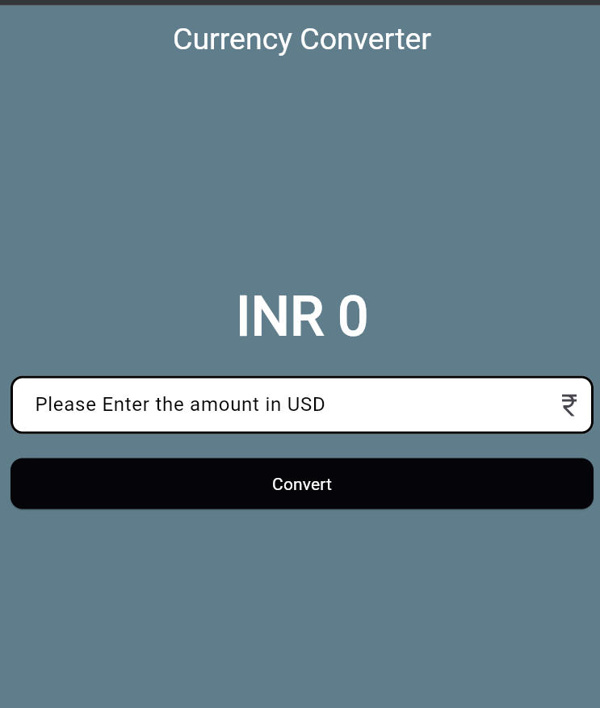
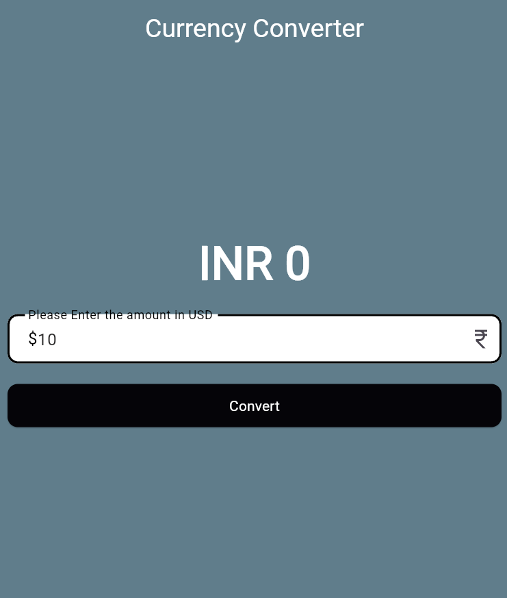
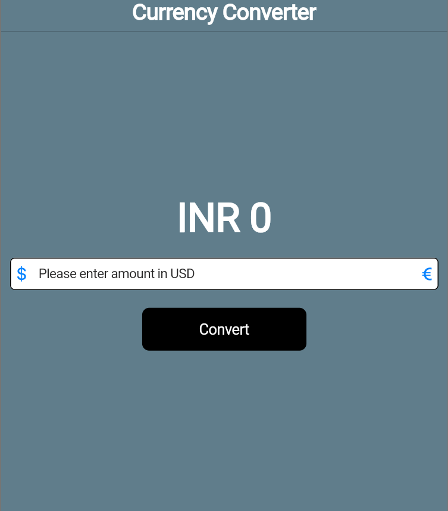
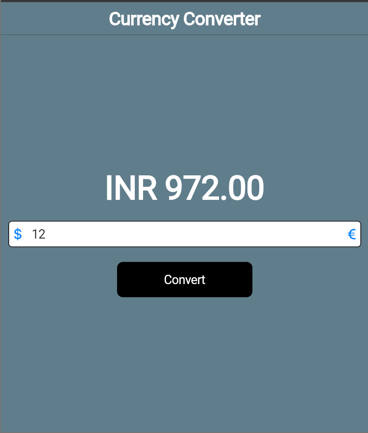

# currency_converter

This is a cross-platform mobile application built using Flutter, designed to run seamlessly on both Android and iOS devices. It follows the design principles of Cupertino for iOS and Material Design for Android, providing a native look and feel on each platform.

## Features

- **Platform-Aware Design:** The app incorporates Cupertino and Material Design components to ensure a consistent and native experience on iOS and Android devices, respectively.
  
- **Responsive UI:** The user interface is designed to be responsive, adapting to various screen sizes and orientations.

- **User Authentication:** Not impleted yet

- **State Management:** Not on this app

- **API Integration:** Avaialble but not activated for this version

- **Offline Support:** Nil

## Getting Started

These instructions will help you set up and run the app on your local machine for development and testing purposes.

### Prerequisites

- [Flutter SDK](https://flutter.dev/docs/get-started/install) installed on your machine.

### Installing

1. Clone the repository to your local machine:

    ```bash
    git clone https://github.com/Mebeingasravi/CurrencyConverter_flutter
    ```

2. Navigate to the project directory:

    ```bash
    cd CurrencyConverter_flutter
    ```

3. Install dependencies:

    ```bash
    flutter pub get
    ```

### Running the App

Run the app on your preferred emulator or connected device:

Try with Android, Ios, Web and Windows App only

```bash
flutter run
```

**Android(Material) Design Screens**

Img1



Img2



**IOs(Cupertino) Design Screens**

Img1



Img2



[online documentation](https://docs.flutter.dev/)
